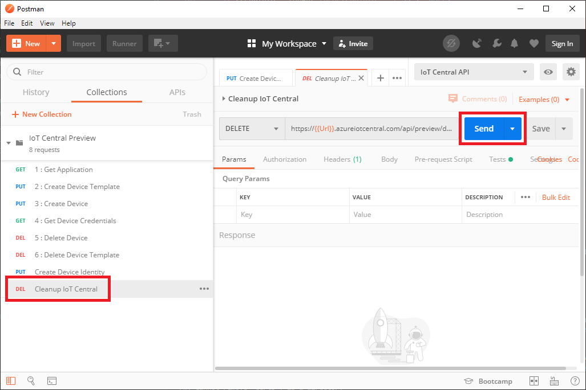
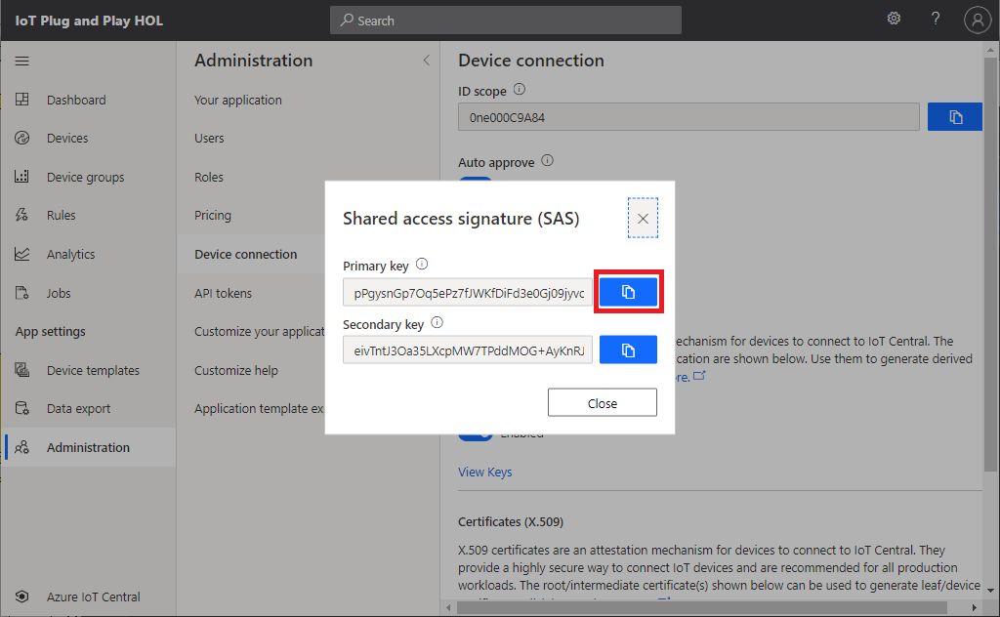

# Device First Provisioning

Cloud first provisioning approach gives the solution owners more control on which devices are allowed to connect to specific solutions.
However, there may be other solutions that you know devices are built for a specific solution.

With Device Provisioning Service, the device app can be written in a way to self register to a solution (or IoT Hub) using Group SAS key.

## Clean up IoT Central Resources

If you have a device identity and a device template in your IoT Central please delete them.

You may run `Cleanup IoT Central` collection in Postman or manually delete them in IoT Central.



## Modify device code

You can generate device Sas key from device id and groups Sas key.  

> [!IMPORTANT]  
> The group sas key should be saved in secure location for real production device

Let's add code to generate a device sas key from the group sas key.  The the generate device Sas key, we can automate the device provisioning.
Furthermore, with IoT Plug and Play, cloud solution can understand devices' capabilities and characteristics.

> [!IMPORTANT]  
> **In VSCode with Remote Connection to RP4**

> [!TIP]  
> If you are interested in you can diff the code changes using VSCode's built-in diff function.  
> [Running Code Diff](https://github.com/daisukeiot/IoT-Plug-and-Play-WS/media/media/code-diff.mp4)

1. Copy and replace `main.c` from `DeviceFirst` folder  

    ```bash
    cp ~/Intelligent-Edge-in-a-Day/lab02/DeviceFirst/main.c ~/Intelligent-Edge-in-a-Day/codegen1
    ```

1. Re-compile with :  

    ```bash
    cmake --build . --config Release
    ```

1. Browse to `Device connection` page of IoT Central  

    

1. Click on `View keys` and copy Group Sas Key (Either primary or secondary key)  

    


## Run the device app

Run the new device app with Group Sas Key

|Parameter     | Description  | Example  |
|--------------|---------|---------|
|Device ID     | An unique device id of your choice                | devicefirstdemo    |
|Scop ID       | Value from IoT Central in Device connection page  | 0ne000C9A84        |
|Group Sas Key | Value from IoT Central in Device connection page  | pP9zp+Ew.....      |

```bash
./codegen1 [Device ID] [Scope ID] [Group Sas Key]
```

1. Verify the new device is now provisioned and connected in IoT Central application
1. Add view and verify you can see telemetry data (all zeros)

## Complete

You just built a device app that can provision without first creating the device identity in Cloud.

Let's re-compile after adding more device specific code that reads sensor data, etc.

[Next Section](IoT-PnP-DeviceSpecificCode.md)

[Go back to top page](readme.md)
