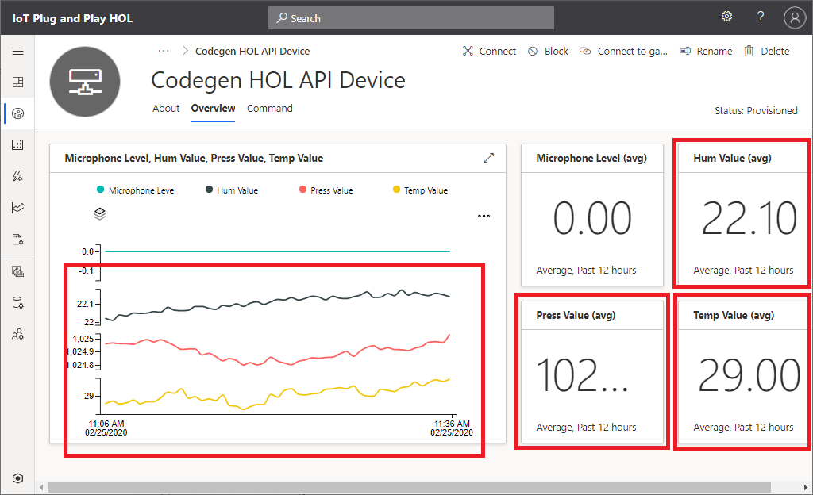

# Device Specific Code

> [!IMPORTANT]  
> **In VSCode with Remote Connection to RP4**

Codege generates template code with placeholder for you to add device specific code.

To compolete your device add, let's add code to read sensor data and device information.

## Device Specific Code Placeholder

Codegen generates .c and .h file with [DCM-ID]_imple.c and [DCM-ID]_imple.h.

With the DCM we used, they are azure1_imple.c and azure1_impl.h

You can find functions like below :

```c
char* DeviceInfo_Property_GetManufacturer()
{
    // TODO: provide implementation here
    return "abc";
}

   :


void Acc_Telemetry_ReadAcc_value(ACC_ACC_VALUE * acc_value)
{
    // TODO: provide implementation here

    acc_value->acc_x = 0.0;

    acc_value->acc_y = 0.0;

    acc_value->acc_z = 0.0;

}
```

To make your device app complete, we need to add code to these placeholder functions.

## Replace Source Files

> [!IMPORTANT]  
> Stop the device app if it is running

`lab02\DeviceSpecific` folder contains 4 files.  Replace source files from `lab02\DeviceSpecific` folder with :

```bash
cp ~/IoT-Plug-and-Play-WS/lab02/DeviceSpecific/* ~/IoT-Plug-and-Play-WS/codegen1
```

## Re-compile

Re-compile the app with :

```bash
cmake --build . --config Release
```

## Run the device app

With the same command line as [the previous step](IoT-PnP-DeviceFirstProvisioning.md#run-the-device-app)

```bash
./codegen1 [Device ID] [Scope ID] [Group Sas Key]
```

Within a few minutes you should see properties reported and telemetry showing the real data



## Complete

Congraturations!

You completed IoT Plug and Play Hands on Lab

Go back to [top page](../README.md)