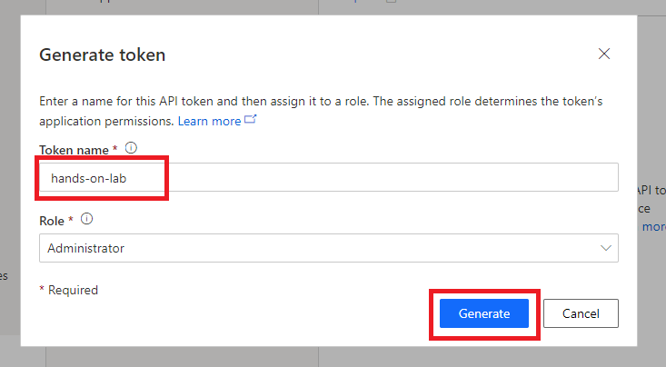
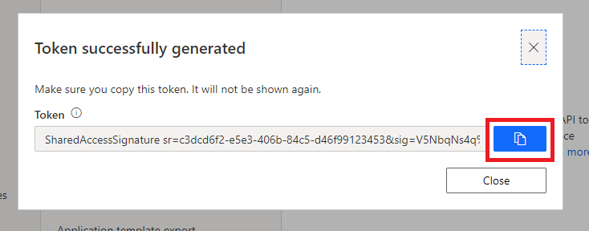
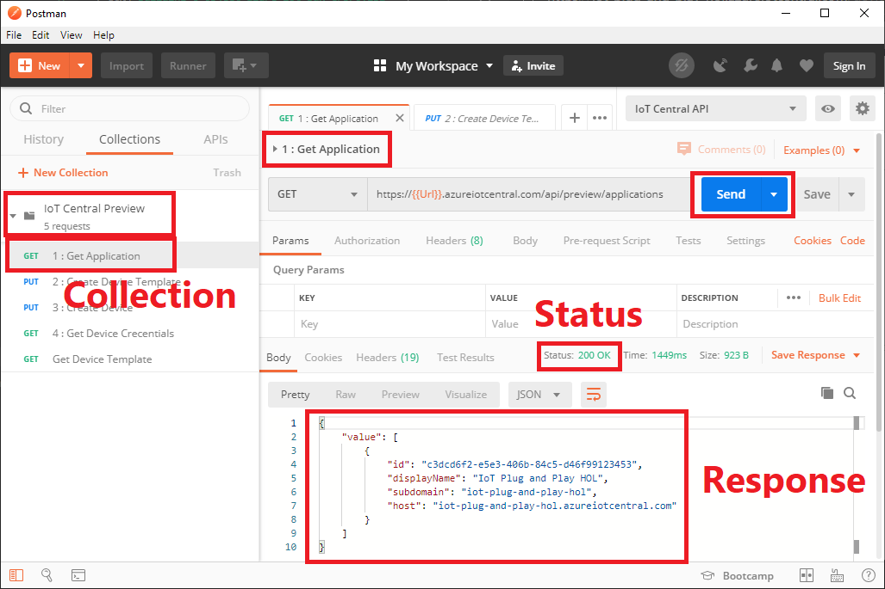

# Setting up Postman

Before sending RESTful API, let's set up Postman collection and environment

> [!IMPORTANT]  
> **On your development machine**  
> Make sure you installed Postman.  If you do not have Postman, please install from [here](https://www.postman.com/downloads/)

## Import Collection and Environment

1. Open Postman
1. Import Collection  
    [File] -> [Import], then select `IoT Central Preview.postman_collection` in `C:\Repo\IoT-Plug-and-Play-WS\lab02\Postman` folder
1. Import Environment  
    [File] -> [Import], then select `IoT Central API.postman_environment` in `C:\Repo\IoT-Plug-and-Play-WS\lab02\Postman` folder

1. Select `Collection` tab and `IoT Central API` environment  

    

1. Click on eyeball icon, then click `Edit` next to `IoT Central API`  

    

1. Browse to your IoT Central Application
1. Navigate to API tokens page, then click `+` to generate a new API Token  

    

1. Provide a token name then click `Generate`  

    

1. Copy the token and past into Postman's `APIToken` Setting  

    

    

1. Navigate to `Your application` page of IoT Central application  
1. Copy `Application Url` to Postman's `Url` setting, then click `Update`

    

    

## Test API

Let's verify the setting by making a simple API call to IoT Central

1. From `IoT Cental Preview` collection, click `1 : Get Application`
1. Click `Send` button
1. Verify IoT Central returns successfully with data

## Complete

Now you have Postman collection and environment to make RESTful API call to IoT Central.

[Next Section](IoT-PnP-DeviceIdentity-API.md)

[Go back to top page](readme.md)
